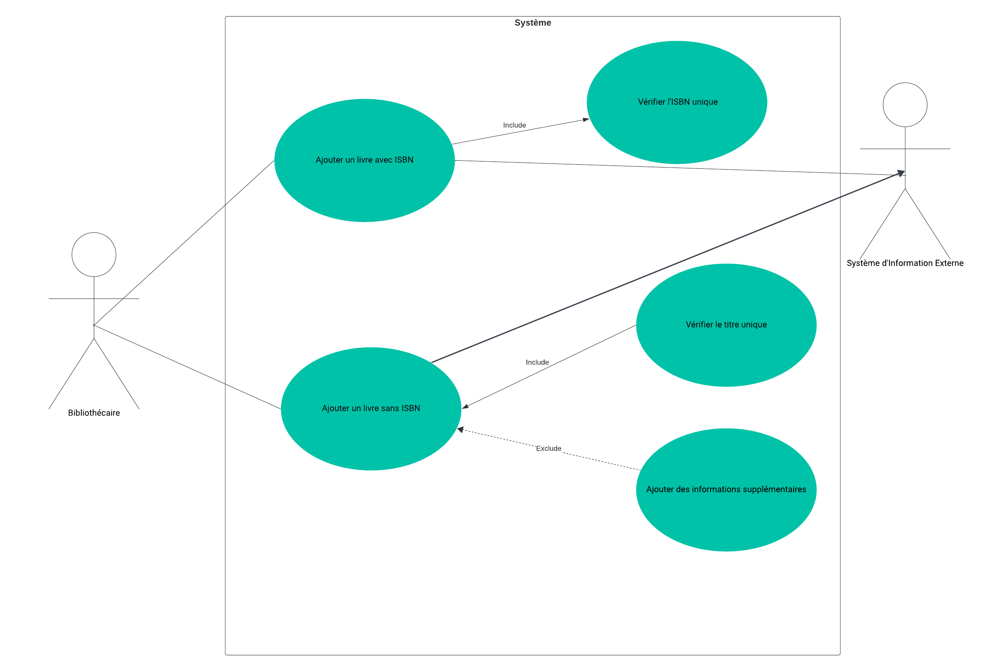
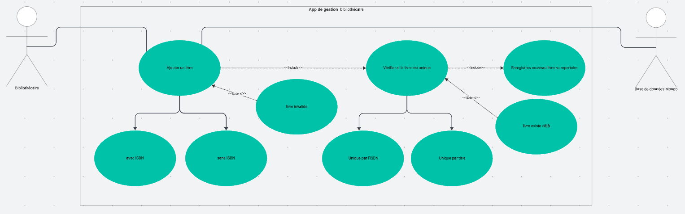
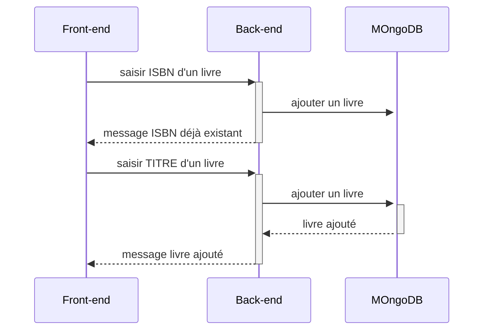
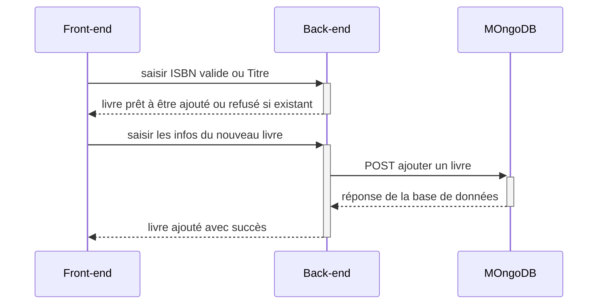

# tp2
## Comment *changer* le système sans difficulté, sans avoir ~~besoin~~ de *comprendre* $e=mc^2$ ?

## Proposition pour changer le système:

1. **Frontend**: Ajouter une nouvelle interface de saisie pour l'ajout de livres
2. **Backend** : Créer un endpoint pour la soumission des nouveaux livres avec et sans ISBN.
3. **Backend** : Pour les livres sans ISBN, mettre en œuvre une vérification d'unicité basée sur le titre pour éviter les doublons.
4. **Base de données**: Modifier le schéma de la collection de livres pour gérer les livres sans ISBN, en utilisant le titre comme clé unique alternative.

## Use case

## Sequence diagram

## Distribution des tâches

| Responsable         | Tâche                                                                                                                      |
|---------------------|----------------------------------------------------------------------------------------------------------------------------|
| Rédacteur technique | Mettre à jour la documentation pour refléter les changements dans le système.                                              |
| Formateur           | Former les bibliothécaires à l'utilisation de la nouvelle interface.                                                       |
| Développeur         | Déployer les mises à jour sur un serveur de test avant de les mettre en production pour assurer une transition en douceur. |
